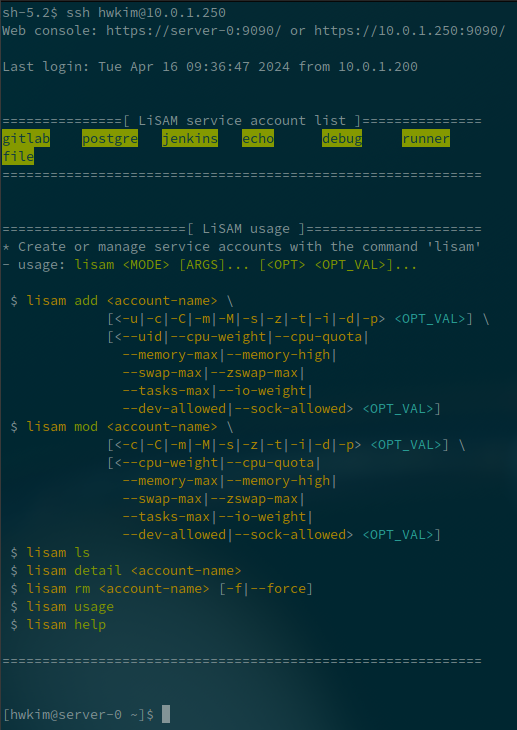

# Linux Service Account Manager (LiSAM)


## Description

Make a new linux user account which can be used as general purpose service account.  
(Mainly targeted for `RHEL`-derivatives, may also work on `Debian`-derivatives)  
  
Users created by this script will:
- Have user systemd service functions (with `loginctl enable-linger` and `export XDG_RUNTIME_DIR`)
- Have limited systemd resources, configured by systemd resource control (cgroups)
- (Optional) Get open ports for the account (with `firewalld`)
  - Ignored if `firewalld` is not installed on the system


## Usage

```

usage: lisam <MODE> [ARGS]... [<OPT> <OPT_VAL>]...


<MODE>

   - add: create a new LiSAM service account
       $ lisam add <account-name> [OPTIONS]...
         [OPTIONS]
           -u, --uid < # >                             : Linux account UID
           -c, --cpu-weight < 1-10000 | idle >         : Systemd CPUWeight
           -C, --cpu-quota < #% >                      : Systemd CPUQuota
           -m, --memory-max < #[K|M|G|T] | 0%-100% >   : Systemd MemoryMax
           -M, --memory-high < #[K|M|G|T] | 0%-100% >  : Systemd MemoryHigh
           -s, --swap-max < #[K|M|G|T] | 0%-100% >     : Systemd MemorySwapMax
           -z, --zswap-max < #[K|M|G|T] | 0%-100% >    : Systemd MemoryZSwapMax
           -t, --tasks-max < # >                       : Systemd TasksMax
           -i, --io-weight < 1-10000 >                 : Systemd IOWeight
           -d, --dev-allowed < ${DEV_PATH} >           : Systemd DeviceAllow
               * Pass multiple options to set more than one device path
           -p, --sock-allowed < 1-65535 >              : Systemd SockBindAllow
               * Pass multiple options to set more than one

   - mod: modify a LiSAM service account
       $ lisam mod <account-name> [OPTIONS]...
         [OPTIONS]
           -c, --cpu-weight < 1-10000 | idle >         : Systemd CPUWeight
           -C, --cpu-quota < #% >                      : Systemd CPUQuota
           -m, --memory-max < #[K|M|G|T] | 0%-100% >   : Systemd MemoryMax
           -M, --memory-high < #[K|M|G|T] | 0%-100% >  : Systemd MemoryHigh
           -s, --swap-max < #[K|M|G|T] | 0%-100% >     : Systemd MemorySwapMax
           -z, --zswap-max < #[K|M|G|T] | 0%-100% >    : Systemd MemoryZSwapMax
           -t, --tasks-max < # >                       : Systemd TasksMax
           -i, --io-weight < 1-10000 >                 : Systemd IOWeight
           -d, --dev-allowed < ${DEV_PATH} >           : Systemd DeviceAllow
               * Pass multiple options to set more than one device path
           -p, --sock-allowed < 1-65535 >              : Systemd SockBindAllow
               * Pass multiple options to set more than one

   - ls: list all LiSAM service accounts
       $ lisam ls

   - detail: print details of an LiSAM service account
       $ lisam detail <account-name>

   - rm: remove an LiSAM service account
       $ lisam rm <account-name> [OPTIONS]...
         [OPTIONS]
           -f, --force                 : Force remove without prompt

   - usage: print usage message
       $ lisam usage

   - help: print help message
       $ lisam help


[OPT_VAL] Special Patterns

   - <X>     : Required wrapper
   - [X]     : Optional wrapper (X can be omitted)
   - #       : Arbitrary digits (positive integer)
   - ${X}    : Arbitrary string (X is a description of the string)
   - A|B     : A or B
   - A-B     : Value range from A to B (inclusive)

```


## Remarks
Check below to utilize the script conveniently (Optional).

- To print manual for this command on ssh login:  
  1. Place `lisam` script to `$PATH` (or just place the script in the directory `~/bin` if your shell supports it by default),  
  2. Then copy the [ssh welcome message script](asset/ssh.rc) to the path `~/.ssh/rc`, or write down your own welcome message script there.  
     
